# Day 1 – Programming Basics & Full Stack

---

## Before we start

**1. What is a programming language?**
Imagine you want to talk to someone who only speaks French, but you only speak English. You'd need a translator. A programming language is exactly that — a translator language between us (humans) and the computer. We write instructions in a language like JavaScript, and the computer follows them exactly, step by step.

**2. Why do we need a programming language?**
We already speak English, Hindi, Telugu, and so on. The problem: a computer doesn't understand *any* human language. A computer only understands one thing — electricity, either **on** or **off**. Human languages are also messy and full of double meanings ("I saw her duck" — did she own a duck, or did she bend down?). A computer can't work with that confusion. So we invented programming languages — simple, strict, no double meanings — that sit *in between* human language and electricity, and can be converted step-by-step into on/off signals a machine understands.

**3. How do we talk to machines? (Binary)**
Think of a computer as a giant wall of light switches. Each switch is either **ON (1)** or **OFF (0)** — nothing in between. This on/off system is called **binary**. Every single thing inside a computer — every letter, number, photo, video, sound — is just a very long pattern of these switches flipped on or off.

*Example:* the letter **A** is stored as `01000001`. That's 8 switches — off, on, off, off, off, off, off, on. When you press "A" on your keyboard, the computer never sees the letter "A" — it only sees that exact pattern of switches.

We never write these switch-patterns by hand ourselves — it would take forever and no human could manage a real app that way. So we write in a programming language instead, and a **compiler / interpreter** (a translator program) automatically converts it into binary for us:


This is the whole reason programming languages exist: they let us write in something readable, while the computer still gets exact on/off instructions underneath.

**4. What is MERN?**
MERN is a nickname for 4 tools used together to build one working web application — one letter for each tool:
- **M** – MongoDB → the database (stores the data)
- **E** – Express.js → a backend framework (organizes server logic)
- **R** – React → the frontend library (what the user sees)
- **N** – Node.js → the backend runtime (runs JavaScript on the server)

Think of it like building a house: React is the rooms you walk into and use, Express + Node is the plumbing and electrical system working behind the walls, and MongoDB is the storage room where everything is kept.


**5. What are we going to do in this bootcamp?**
We'll learn each of these 4 pieces one at a time — starting with the basics of JavaScript, then React (frontend), then Node + Express (backend), then MongoDB (database) — and by the end, connect all of them into one real, working application, the same way it's done in real companies.

---

## What is Full Stack?

**Full stack** means building *both* the parts of a web application — what users see (frontend) and the logic that runs behind the scenes (backend + database). A "full stack developer" works across all these layers.

### 1. 🖥️ Frontend — "What users see"
This runs **in the browser**. It's responsible for displaying buttons, forms, pages, and everything a user interacts with. We use **React** — React breaks the UI into reusable components.

### 2. ⚙️ Backend — "The brain"
This runs **on a server**, invisible to the user. We use **Node.js** (the runtime environment) with **Express** (a framework for handling HTTP requests). When a user clicks a button, the frontend sends an HTTP request → the backend receives it, runs logic, and sends back a response.

### 3. 🗄️ Database — "Memory"
This is where data is permanently stored:
- **MongoDB** — a NoSQL database that stores flexible, JSON-like documents
- **SQL Database** (MySQL/PostgreSQL) — stores structured data in tables with rows and columns

### 🔁 How they connect

```
Browser (React) ←── HTTP ──→ Node.js + Express ←──→ MongoDB / SQL
```

The frontend talks to the backend via HTTP requests (like fetching your profile data), and the backend reads/writes to the database.



> **In short:** Frontend = what you see, Backend = what it does, Database = what it remembers. Full stack = all three together.

---

## TypeScript's Role

You'll notice **TypeScript** shows up on both the frontend (with React) and the backend (with Node.js + Express) in the diagram above. That's because TypeScript isn't tied to one side — it sits underneath both, adding **type safety** to whatever code it's used with.

**What does "type safety" mean, in plain terms?** It means TypeScript checks your code *while you're writing it* and warns you if you're about to make a mistake — like trying to add a number to a word, or using a variable that doesn't exist. Without it, that same mistake would only be discovered later, after the app actually runs and breaks.


We haven't started JavaScript itself yet — that comes first. TypeScript builds *on top of* JavaScript, so once we're comfortable with JavaScript, TypeScript will feel like a small, helpful add-on rather than a whole new language.
